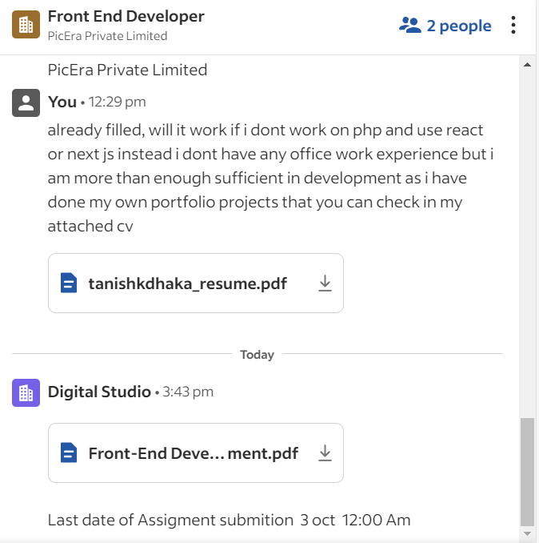

# My React Project



## About the Project
This React project for image gallery. asked for permission to do in react as shown in above chat.

---

## Project Setup

### Prerequisites

Make sure you have the following installed on your system:
- Node.js (v14 or later)
- npm (v6 or later) or yarn (v1.22 or later)
- Git

### Installation

1. Clone the repository to your local machine:
    ```bash
    git clone https://github.com/TanniTemp/picera-assignment.git
    cd picera-assignment
    ```

2. Install the dependencies:
    ```bash
    npm install
    ```
    or
    ```bash
    yarn install
    ```

### Running the Project

To start the development server, run the following command:

```bash
npm start
